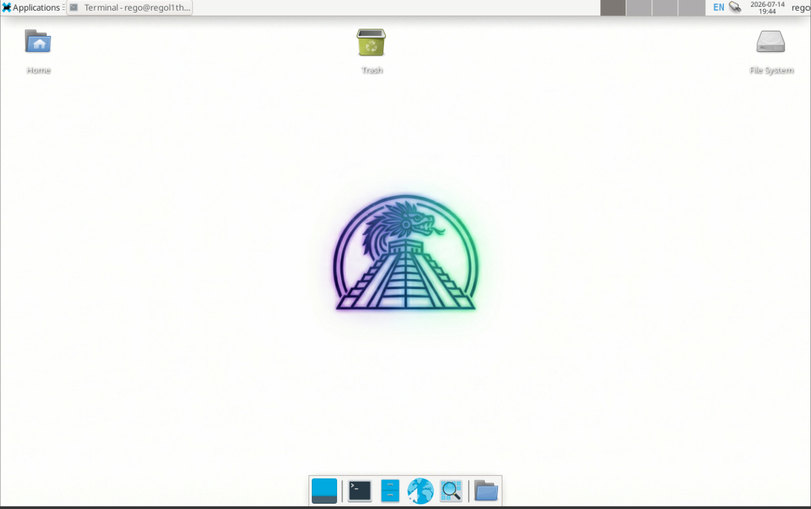
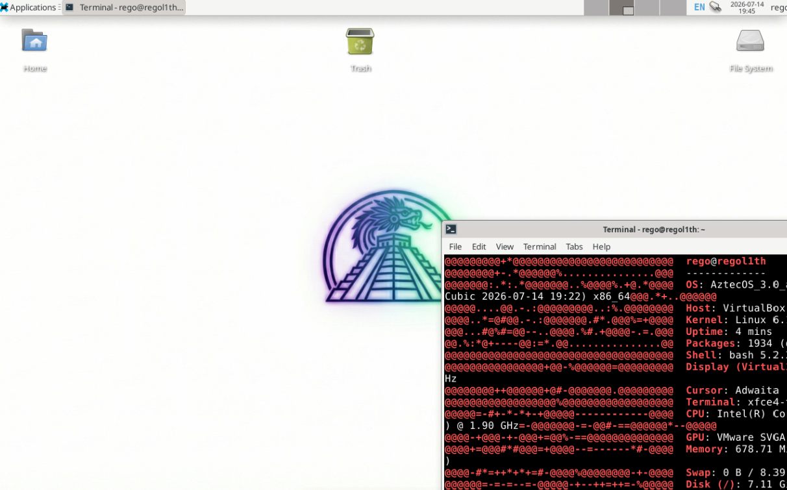
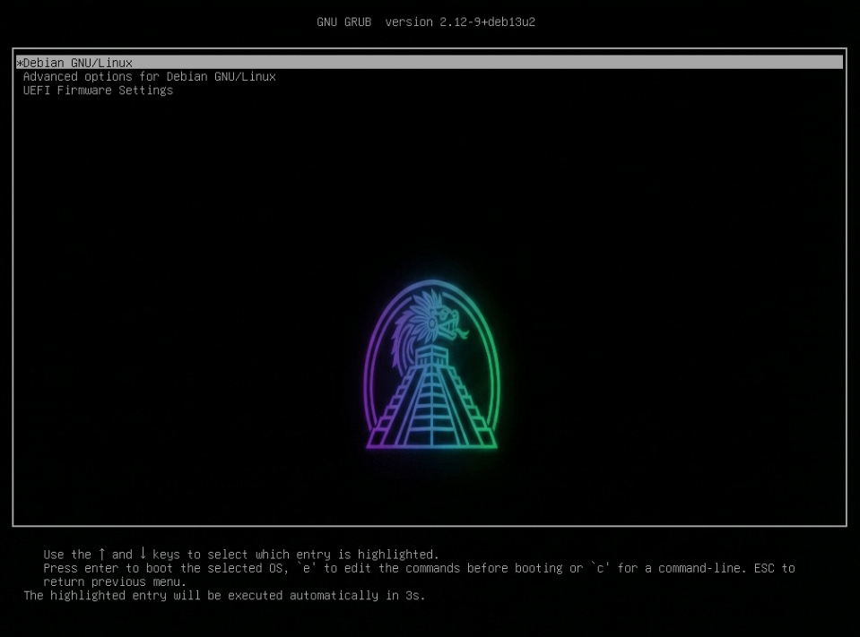
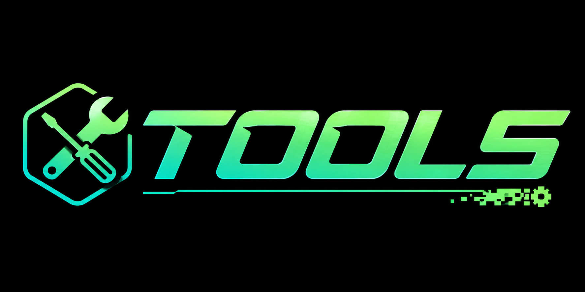

---

# AztecOS 
**The perfect balance between nature, development, and cybersecurity.**

AztecOS is a Debian-based Linux distribution, designed from the ground up to offer an efficient, highly customizable, and combat-ready working environment. Whether you are writing code or auditing networks, AztecOS gives you the tools you need without sacrificing performance or aesthetics.

---

##  Table of Contents
1. [About the Project](#-about-the-project)
2. [System Requirements](#-system-requirements)
3. [Download](#-download)
4. [Included Tools (Manual)](#-included-tools-manual)
5. [Installation Guide](#-installation-guide)
6. [Customization](#-customization)

---

## About the Project
The goal of AztecOS is to democratize access to a professional hacking and development environment. Many cybersecurity distributions are overloaded or difficult to use as a daily driver. AztecOS solves this by offering a solid Debian base with a minimalist approach that allows you to scale the system to your needs.

## About the System
AztecOS provides a clean, efficient, and visually unique environment. 

*   **Clean Desktop:** Preconfigured with XFCE for maximum performance.

*   **Unique Branding:** Custom wallpapers and icons inspired by Aztec culture.

---

### What makes us different?
* **Lightweight and Efficient:** We don't install bloatware. Only what is necessary for the system to "fly".
* **"Nature & Tech" Aesthetics:** A unique visual design inspired by Aztec iconography and jade colors.
* **Total Freedom:** Architecture designed for the user to dismantle and customize every corner.

---

##  System Requirements
To ensure optimal performance, your hardware should meet these minimum requirements:
* **Processor:** 64-bit Dual Core CPU (1.5 GHz or higher).
* **RAM:** 2 GB (4 GB recommended for cybersecurity tasks).
* **Storage:** 15 GB of free space.
* **Graphics:** Capable of 1024x768 resolution.

---

## Included Tools (Manual)
AztecOS utilizes a unique command-line interface for tool management. Simply type `tools-help` in your terminal to view this manual. Use the command specified below to install your desired suite:

| Command | Category | Purpose |
| :--- | :--- | :--- |
| `tools-cibersec-1` | Network Basics | Core networking: `nmap`, `wireshark`, `netcat`. |
| `tools-cibersec-2` | Intermed. Pentest | Scanning & Exploitation: `gobuster`, `hashcat`, `hydra`. |
| `tools-cibersec-3` | Full Pentest Suite | Advanced toolkit: `ffuf`, `cewl`, `crunch`, `tcpdump`, `smbclient`. |
| `tools-dev` | Development | Dev essentials: `git`, `python3`, `docker`, `VS Code`, `Zed`. |
| `tools-office` | Productivity | Office suite: `libreoffice`, `cherrytree`, `thunderbird`. |
| `tools-videoeditor` | Design & Video | Creative suite: `gimp`, `inkscape`, `audacity`, `pitivi`. |
| `tools-gaming` | Gaming | Entertainment: `steam`, `discord`, `heroic`. |
| `tools-privacy` | Privacy | Anonymity: `torbrowser`, `proxychains`, `macchanger`. |
| `tools-media` | Multimedia | Media consumption: `vlc`, `qbittorrent`, `obs-studio`. |
| `tools-sysadmin` | System Admin | Maintenance: `htop`, `gparted`, `timeshift`. |

---

##  Installation Guide

### Virtual Installation (VirtualBox)
1. Create a new "Linux" (Debian 64-bit) virtual machine.
2. **Important:** Go to **Settings > System > Motherboard** and check **"Enable EFI (special OSes only)"**.
3. Assign at least 2GB of RAM and 20GB of dynamic storage.
4. Go to **Settings > Storage**. Under the "Controller: IDE" or "SATA" tree, click on the empty disk icon, then click the disk icon on the right to **"Choose a disk file"** and select your `AztecOS.iso`.
5. Start the VM and follow the graphical installer.

### Physical Installation
1. Flash the ISO to a USB drive (min 8GB) using [BalenaEtcher](https://balena.io/etcher).
2. Reboot your PC and enter the **BIOS/UEFI** (usually F2, F12, or Del).
3. Select your USB drive as the primary boot device.
4. Follow the installer wizard to partition your disk and set up your user.
---

## Customization
AztecOS encourages users to make the system their own. In the `assets/` folder, you will find all official logos and wallpapers. Feel free to modify GTK themes and your `.bashrc` or `.zshrc` to adapt the terminal to your specific workflow.

---

## 📥 Download
You can download the full AztecOS v1.3 ISO image here:

👉 **[Download AztecOS v1.3 ISO (Direct Link)](https://drive.google.com/uc?export=download&id=1vSwkyG2ShK0t2FsZNthR2jzgHbmLff6-)**

---

## Author

**Elias Diaz Gutierrez** — [@Ely-Retr0](https://github.com/Ely-Retr0)  
*Cybersecurity Specialist · Software Developer · Cloud Specialist*  
*Think outside the firewall*

---
> ⚠️ This project is a work in progress. The first version is available now!.
