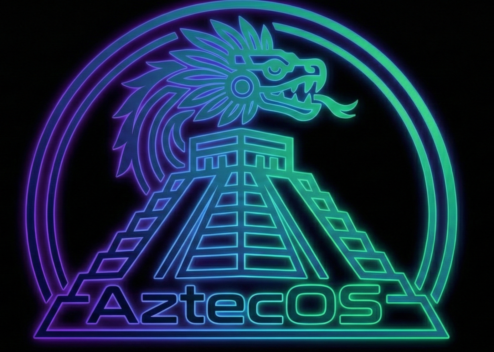

---

# AztecOS 🐍🛡️
**El equilibrio perfecto entre la naturaleza, el desarrollo y la ciberseguridad.**

AztecOS es una distribución de Linux basada en Debian, diseñada desde cero para ofrecer un entorno de trabajo eficiente, altamente personalizable y listo para el combate. Ya sea que estés escribiendo código o auditando redes, AztecOS te da las herramientas que necesitas sin sacrificar el rendimiento ni la estética.

---

## 📖 Tabla de Contenidos
1. [Sobre el Proyecto](#-sobre-el-proyecto)
2. [¿Qué nos hace diferentes?](#-qué-nos-hace-diferentes)
3. [Herramientas Incluidas](#-herramientas-incluidas)
4. [Guía de Instalación](#-guía-de-instalación)
5. [Personalización](#-personalización)

---

## 🎯 Sobre el Proyecto
La meta de AztecOS es democratizar el acceso a un entorno de hacking y desarrollo profesional. Muchas distribuciones de ciberseguridad están sobrecargadas o son difíciles de usar como sistema operativo diario. AztecOS soluciona esto ofreciendo una base sólida de Debian, garantizando estabilidad, pero con un enfoque minimalista que te permite escalar el sistema a tu medida.

### Similitudes con otras distros:
* **Base Debian:** Comparte la misma estabilidad, gestión de paquetes (`apt`) y seguridad que distros como Kali Linux o Parrot OS.
* **Orientación al Pentesting:** Viene preconfigurada con las herramientas estándar de la industria.

### Diferencias clave:
* **Ligereza y Eficiencia:** No instalamos bloatware. Solo lo necesario para que el sistema "vuele", ideal para compilar código o correr scripts de fuerza bruta sin cuellos de botella.
* **Estética "Nature & Tech":** Un diseño visual único inspirado en la selva y la iconografía azteca (colores terrosos, verde jade), rompiendo el molde del clásico "verde neón sobre negro".
* **Libertad Total:** Aunque tiene una identidad visual fuerte, la arquitectura permite al usuario desarmar y personalizar cada rincón visual y funcional de la distro.

---

## 🛠️ Herramientas Incluidas
AztecOS viene con un arsenal preinstalado para que empieces a trabajar desde el primer minuto:
* **Reconocimiento:** `nmap`, `wireshark`
* **Explotación y Web:** `burpsuite`
* **Criptografía y Cracking:** `hashcat`
* *(Lista en constante expansión)*

---

## 💻 Guía de Instalación
*(Nota: AztecOS se encuentra en fase de desarrollo activo. Los enlaces de descarga de la imagen .ISO estarán disponibles próximamente).*

1. **Descarga la ISO:** Obtén la última versión de AztecOS desde la sección de *Releases* en este repositorio.
2. **Crea tu USB Booteable:** Utiliza herramientas como [BalenaEtcher](https://balena.io/etcher) o `dd` en Linux para flashear la ISO en una memoria USB de al menos 8GB.
3. **Arranca desde la USB:** Reinicia tu computadora, entra a la BIOS/UEFI y selecciona la USB como primer dispositivo de arranque.
4. **Instalación:** 
   * Selecciona "Install AztecOS" en el menú de arranque.
   * Sigue el asistente gráfico para configurar tu idioma, zona horaria y particiones de disco.
   * Crea tu usuario administrador y espera a que finalice la instalación.
5. **¡Listo!** Retira la USB y reinicia para entrar a tu nuevo entorno.

---

## 🎨 Personalización
AztecOS anima a los usuarios a hacer suyo el sistema. En la carpeta `assets/` de este repositorio encontrarás todos los logos oficiales y fondos de pantalla (wallpapers) para que puedas aplicarlos incluso si usas otros entornos de escritorio. 

Siéntete libre de modificar los temas GTK y el archivo `.bashrc` para adaptar la terminal a tu flujo de trabajo.

## Author

**Elias Diaz Gutierrez** — [@Ely-Retr0](https://github.com/Ely-Retr0)  
Cybersecurity Specialist · Software Developer · Cloud Specialist  
*Think outside the fierrewall*

---

> ⚠️ This project is a work in progress. No stable release yet.
